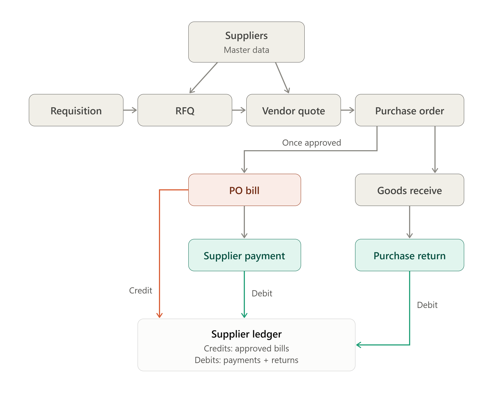
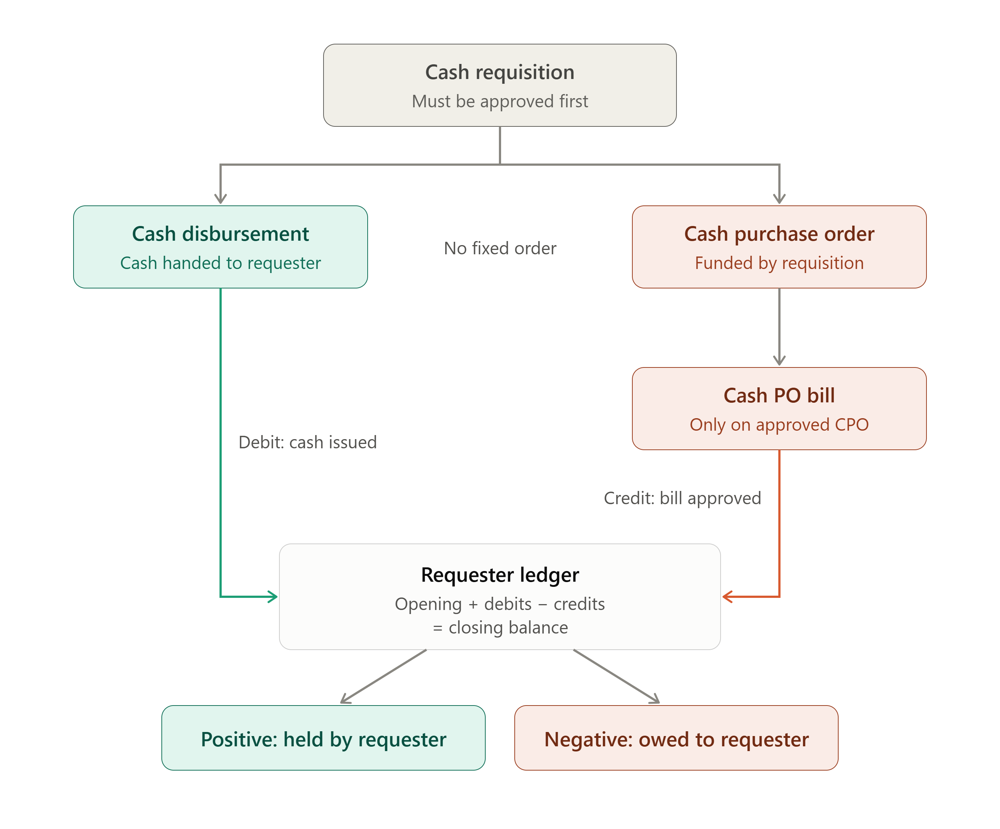

# BuilderERP — User Guide

This guide is for end users of BuilderERP. It explains how to sign in, navigate the app, and work with each module. For developer/setup documentation, see [README.md](README.md).

## 1. Signing In

1. Open the application URL in your browser and go to the **Login** page.
2. Enter your email and password and click **Sign In**.
3. If you don't have an account, ask your administrator to create one and assign you a role (see [Roles & Permissions](#8-users-roles--permissions)).
4. If you enter the wrong password 5 times, your account will be locked for 15 minutes.

Your name and account options appear in the top-right corner of the screen after signing in, alongside notification and message icons.

## 2. Navigating the App

The app uses a fixed layout:

- **Top bar** — the BuilderERP logo/home link, a search box, notification/message icons, and your account menu.
- **Left sidebar** — a collapsible menu grouped by module (e.g. CRM, Sales, Procurement). Click a section title to expand/collapse it; click the hamburger icon (☰) in the top bar to collapse the whole sidebar for more screen space.
- **Main content area** — the page for whatever module/action you've selected.

**You only see menu sections and items you have permission to view.** If a module is missing from your sidebar, your account doesn't have access to it — contact an administrator.

The sidebar remembers which sections you had open and your scroll position between page loads.

## 3. Common Patterns Across Modules

Nearly every module in BuilderERP follows the same list → view → create/edit pattern:

- **Index (list) page** — a table of records for that module, usually with search/filter controls and pagination. Click a row or an action icon to view details.
- **Details page** — read-only view of a single record, often with related sub-records (e.g. a Sale Agreement showing its Installment Plan).
- **Create / Edit forms** — fields are validated as you type (via FluentValidation on the server and jQuery Validation on the client); required fields are marked, and the form won't submit until errors are resolved.
- **Delete** — usually requires a confirmation step; some records can't be deleted if referenced elsewhere (e.g. a Property Unit already linked to a Sale Agreement) and will show an error instead.

Buttons for Create/Edit/Delete only appear if your role has the corresponding permission (e.g. `ProjectView` lets you see Projects, but you also need a create/edit permission to modify them).

## 4. Dashboard

**Dashboard & Analytics → Management Dashboard** is the landing page after login for users with dashboard access. It shows cross-module KPIs and summaries (sales, collections, construction progress, etc.) at a glance. Use it as your starting point before drilling into a specific module.

## 5. Module Reference

The sidebar is organized into the following sections. Each links to a list of controllers/screens for that module.

### Administration
Company, Branch, Department, Project, Cost Center setup, plus **Users** and **Roles** management. Typically restricted to admins — this is where the organizational structure and access control are configured.

### Property Management
**Buildings → Towers → Floors → Property Units** — the physical inventory hierarchy. Set these up before creating sales bookings, since a Sale Agreement/Booking references a specific Property Unit.

### CRM
**Leads → Inquiries → Follow-ups → Customers.** Track prospective buyers from first contact (Lead/Inquiry) through scheduled follow-up calls/visits to conversion into a **Customer** record used in Sales.

### Sales
**Quotations → Bookings → Sale Agreements.** Issue a price quotation to a customer, convert it to a booking against a Property Unit, then generate the formal Sale Agreement.

### Installments
**Installment Plans → Installments → Receipts.** Define a payment schedule for a sale, track individual installment due/paid status, and record receipts against payments received.

### Procurement
**Suppliers → Purchase Requisitions → RFQs → Vendor Quotations → Purchase Orders → Goods Receives → Purchase Returns → PO Bills → Supplier Payments → Supplier Ledger.** The standard procure-to-pay flow: a requisition triggers RFQs sent to suppliers, vendor quotations are compared, a Purchase Order is issued, goods are received against it, and returns are recorded if needed. Once a Purchase Order is **Approved** it can be billed (**PO Bills**) and paid (**Supplier Payments**); the **Supplier Ledger** shows each supplier's running balance, computed live from their approved bills (credit) minus payments and approved/completed returns (debit).

On the **Purchase Orders** page, click **How it works** next to the page title to see this diagram in a popup.

#### Cash Purchase Workflow (petty cash / on-the-spot buying)

A separate, lighter flow covers purchases paid for with cash handed to an employee, instead of going through the full RFQ/Vendor-Quotation cycle. It is anchored on an **approved Cash Requisition** and produces its own running account per employee, the **Requester Ledger**:

Each of the cash pages (Cash Requisitions, Cash Purchase Orders, Cash Disbursements, Cash PO Bills, Requester Ledger) has a **How it works** link next to its title that opens this diagram in a popup.

1. **Cash Requisition** (Procurement → Cash Requisitions) — the employee's request for cash to make a purchase. It must be **Approved** before any of the steps below can happen against it.
2. **Cash Disbursement** (Procurement → Cash Disbursements) — the cash actually handed to the requester against that requisition. Recording one only requires an approved requisition; it does **not** require a Cash PO or bill to exist yet. This is a **debit** in the Requester Ledger.
3. **Cash Purchase Order (CPO)** (Procurement → Cash Purchase Orders) — an order placed with a supplier, funded by the requisition.
4. **Cash PO Bill** (Procurement → Cash PO Bills) — how the requester accounts for what was actually bought against a CPO. Only an approved/received CPO can be billed, and a bill can't exceed a CPO line's ordered quantity minus what's already been billed on it. Once the bill's status is set to **Approved**, it becomes a **credit** in the Requester Ledger.
5. **Requester Ledger** (Procurement → Requester Ledger) — nets the two sides per employee: *opening balance + debits (cash issued) − credits (bills approved) = closing balance*. A positive balance means the requester is still holding cash that hasn't been accounted for yet; a negative balance means they've spent more than was issued and the company owes them the difference. Both the on-screen ledger and its **Print** view state this plainly (e.g. "held by requester" / "owed to requester").

Steps 2–4 don't have to happen in a fixed order relative to each other — cash can be disbursed before or after the CPO is placed — but each one individually depends on the requisition being Approved, and a bill depends on its own CPO being Approved. Cash PO Bills have their own **Print** view (Accounts copy + Requester copy), separate from the ledger print-out.

### Engineering Work Orders
**EWO Requisitions → Engineer Work Orders → EWO Bills → Supplier Payments → Supplier Ledger.** An Engineer Work Order (EWO) sets the items and rates for a contractor (the "schedule of rates"). The contractor is paid in stages as the work progresses.

1. **Payment Heads** are the stages the contractor is paid by, e.g. Vertical 18%, Internal 22%, RCC 15%, Roof 15%, Finishing 20%, Security 10%. They must total 100%. Enter them on the work order form. **Use standard split** fills in the six heads above. On an approved work order use the **Payment Heads** button. Heads can be changed until the first bill is raised; after that, revise the work order.
2. **EWO Bill** (Engineering Work Orders → EWO Bills, or **New Bill** on the work order). Only the latest approved/active revision with payment heads can be billed. A bill has three parts:
   - **Measurement**: the *total* quantity done so far on each item, not just since the last bill. It starts from the previous bill's measurement. Rates come from the work order, and a quantity can't exceed the work order quantity.
   - **Heads claimed**: claim a whole head (**Full**) or any part of it (e.g. 9 = half of an 18% head). What earlier bills claimed is shown and can't be claimed again.
   - **Additions / deductions** (optional): extra work or labour billed by the contractor, or AIT, VAT, advance adjustment, company-supplied materials and other charges billed to the contractor.
3. **Calculation (cumulative):** *measured total × all heads claimed so far − amounts certified on earlier bills = certified on this bill*, then *+ additions − deductions = net payable*. Example: bill 1 measures 275,080 and claims Vertical + Internal (40%), so it pays 110,032. Bill 2 re-measures 290,000 and claims RCC + Roof. That gives 290,000 × 70% − 110,032 = 92,968, which includes the 5,968 catch-up on the heads already paid.
4. Only one bill per work order can be **Draft** at a time. Once **Approved**, a bill is locked, can be paid, and appears in the supplier ledger. Only the latest bill of a work order can be deactivated, and only after its payments are voided.
5. **Pay** the bill from Supplier Payments (EWO bills are listed under their own group), or with **Pay** on the EWO Bills grid. Partial payments are allowed.
6. **Statement** (on the EWO Bills or Engineer Work Orders grid) shows one work order's position across all revisions: each head's claimed/remaining %, every bill with paid and outstanding amounts, and the value not yet billed. That value is the unclaimed heads, such as Security retention.
7. **Supplier Ledger** includes approved EWO bills (credit, net payable) and their payments (debit), alongside PO bills. Use the **Source** filter (All / PO only / EWO only) to see one side. **EWO Supplier Ledger** in the menu opens it with EWO pre-selected. Use **All** for the supplier's true balance.

### Construction Project Management
**Work Breakdown (WBS) / Gantt Chart → Milestones → BOQ → Daily Progress → Site Photos → Delay Analysis → Budget Lines / Budget vs Actual.** Plan and track construction execution: break the project into WBS tasks (viewable as a Gantt chart), track milestones, manage the Bill of Quantities, log daily site progress with photos, analyze delays, and monitor budget vs. actual spend.

### Engineering
**Drawings → Revisions → Approvals.** Manage design drawings, their revision history, and the approval workflow before they're released for construction use.

### Contractor Management
**Contractors → Work Orders → Rate Contracts → Running Bills → Security Deposits → Performance Evaluations → Contractor Ledger.** Onboard contractors, issue work orders against rate contracts, process running (interim) bills, track deposits held, evaluate performance, and view each contractor's running account ledger.

### Labor Management
**Workers → Attendance → Overtime → Salary/Wages → Safety Training.** Manage the workforce roster, daily attendance, overtime hours, wage calculation, and mandatory safety training records.

### Equipment Management
**Equipment → Rentals → Fuel Logs → Maintenance → Operator Assignment.** Track owned/rented machinery, fuel consumption, maintenance history, and which operator is assigned to which equipment.

### Quality Control
**Material Inspection → Site Inspection → Test Reports → NCR → Punch List → Quality Checklist.** Inspect incoming materials and site work, log lab/field test reports, raise Non-Conformance Reports (NCRs) for defects, maintain punch lists, and run standard quality checklists.

### Safety (HSE)
**PPE Tracking → Safety Inspection → Incident Reporting → Risk Assessment → Safety Audit.** Track personal protective equipment issuance, conduct safety inspections and audits, report incidents, and document risk assessments.

### Document Management
**Documents → Versions.** Central repository for project/contract documents with version history — use **Versions** to see or roll back to a prior revision of a document.

### Inventory
**Warehouses → Materials → Stock → Stock Transfers → Stock Issues → Stock Returns → Stock Adjustments.** Manage warehouse locations, the materials master list, current stock levels, transfers between warehouses, issues to sites, returns, and manual stock adjustments.

### Legal Module
**Land Documents → Land Mutations → Land Registrations → Legal Cases → Legal Agreements → Legal Notices.** Manage land title documents, ownership mutations and registrations, ongoing legal cases, legal agreements, and formal notices.

### After Handover
**Flat Handovers → Snag Items → Defect Records → Warranties → Maintenance Requests → Service Tickets.** Once a unit is handed over to a customer: record the handover, log snag-list items and defects found, track warranty periods, and manage post-handover maintenance requests and service tickets.

### Facility Management
**Apartment Maintenances → Utility Bills → Visitor Logs → Security Incidents → Parking Slots → Common Area Bookings.** Day-to-day operation of completed buildings: recurring apartment maintenance, utility billing, visitor/security logs, parking slot allocation, and bookings for shared amenities (function halls, clubhouses, etc.).

### Reports
**Report Catalog** — a searchable list of pre-built reports across modules, each exportable to **Excel** or **PDF**.

## 6. Generating Reports

1. Go to **Reports → Report Catalog**.
2. Select the report you need (organized by module — Sales, Procurement, Construction, etc.).
3. Set any filters (date range, project, status, etc.) offered by that report.
4. Choose **Export to Excel** or **Export to PDF** to download the result, or view it on screen if that report supports it.

## 7. Search

Use the search box in the top bar to look for records by name/number across the app (where supported). Most list pages also have their own inline search/filter fields for narrowing results within that module.

## 8. Users, Roles & Permissions

BuilderERP uses role-based access control:

- **Users** (Administration → Users) — create accounts and assign one or more roles.
- **Roles** (Administration → Roles) — each role is a bundle of permissions (e.g. `ProjectView`, `PurchaseOrderCreate`). A permission typically follows a `<Module><Action>` pattern (`View`, `Create`, `Edit`, `Delete`, etc.).
- A user only sees sidebar sections and action buttons for permissions their role(s) grant.

If you need access to a module or action you don't currently have, ask an administrator to add the relevant permission to your role (or assign you an additional role).

## 9. Tips

- **Can't find a menu item?** It's either hidden by permissions or the section is collapsed — click the section title to expand it.
- **Form won't submit?** Check for red validation messages under each field — all required fields must be filled and in the expected format.
- **Can't delete a record?** Some records are protected from deletion once referenced by another record (e.g. a Material used in a Purchase Order); edit/deactivate it instead, or remove the dependent records first.
- **Session expired?** You'll be redirected to the login page; sign in again and you'll typically return to where you left off.

## 10. Getting Help

For access issues, contact your system administrator. For bugs or feature requests, report them through your organization's usual support channel.
